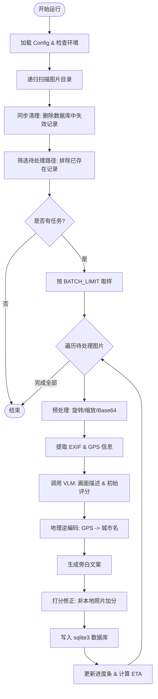

# analyze_photos.py 代码分析与逻辑梳理报告

## 1. 功能概述

`analyze_photos.py` 是一个用于自动化照片分析、评估和文案生成的 Python 脚本。它通过结合本地传统的图像处理技术与现代的大语言模型（VLM/LLM），实现对个人相册的深度管理和数据挖掘。

### 核心目标：
- **自动化打分**：从“回忆价值”和“美学价值”两个维度对照片进行量化评分。
- **智能文案生成**：为照片生成具有“意境”的旁白短句。
- **元数据丰富化**：提取并修正 GPS 信息，实现地理位置逆编码（获取详细城市名）。
- **数据同步**：维护一个 SQLite 数据库，确保本地文件与记录的一致性。

---

## 2. 核心模块分析

### 2.1 NAS 掉盘守护 (Volumes Guard)
针对 macOS 环境下网络挂载卷（NAS）可能发生的连接中断，脚本实现了自动重连逻辑：
- `_is_mount_ok()`: 判断挂载路径是否有效。
- `_try_remount_nas()`: 通过 AppleScript 尝试静默重新挂载。
- `_read_bytes_with_nas_retry()`: 带重试机制的文件读取，增强了分布式存储环境下的稳定性。

### 2.2 图像预处理与编码
在将图片发送给 VLM 之前，脚本执行以下操作：
- **纠偏旋转**：基于 EXIF 中的 Orientation 信息进行自动转正。
- **色彩空间统一**：将 RGBA/黑白 等模式统一转换为 RGB JPEG。
- **智能缩放**：根据配置 `VLM_MAX_LONG_EDGE` 限制长边尺寸，平衡推理成本与识别效果。

### 2.3 元数据管理
- **EXIF 提取**：使用 `PIL` 和 `exiftool`（作为增强方案）读取快门、光圈、ISO、拍摄机型等。
- **地理位置解析**：核心在于 `find_nearest_city`，利用本地的一份中文城市坐标 CSV 数据库，通过 `haversine` 算法和 **网格索引（Grid Index）** 快速查找距离最近的城市中心，避免了频繁调用在线逆编码服务。

### 2.4 大模型 (VLM) 交互
脚本定义了两个主要的 Prompt 任务：
1. **主分析任务 (`call_vlm`)**：生成画面描述（caption）、类型标签（type）、回忆分和美学分。
2. **旁白生成任务 (`generate_side_caption`)**：输出极简且有余味的短句，避开“鸡汤式”辞藻。

---

## 3. 代码执行流程梳理

以下是程序的逻辑执行顺序：

1. **初始化**：加载配置，检查 `exiftool` 可用性。
2. **扫描文件**：递归扫描指定目录，过滤非图片文件及“screenshot”关键字命名的截图。
3. **数据库自愈**：
    - 比对磁盘文件与数据库记录。
    - **同步删除**：如果磁盘文件已移除，则从数据库中清理对应的过时条目。
4. **增量筛选**：通过 `filter_unscored` 仅保留尚未在数据库中存在的路径，实现断点续传。
5. **主循环处理**（批量处理）：
    - **预解析**：读取物理图片的 EXIF 尺寸、地理信息。
    - **VLM 分析**：调用大模型接口，获取内容描述和智能评分。
    - **二次打分修正**：如果检测到拍摄地不在“常驻住宅”范围内，自动为“回忆分”增加权重。
    - **旁白生成**：独立生成一句话文案。
    - **地理逆编码**：根据 GPS 经纬度映射到具体的中文城市。
6. **持久化**：将所有解析出的字段（包含原始 JSON 和结构化数据）存入 SQLite。
7. **统计输出**：计算进度百分比和预估剩余时间 (ETA)。

---

## 4. Mermaid 流程图

---

## 5. 技术要点总结
- **鲁棒性**：通过 NAS 掉盘防护和异常捕获，确保长时间批量运行不中断。
- **性能**：利用网格索引实现的本地地理编码器，极大地提升了处理海量带坐标照片时的效率。
- **可复用性**：结构化的数据存储（`exif_json` 和 `raw_json` 同时保存）为未来的功能扩展（如语义搜索）留下了空间。
