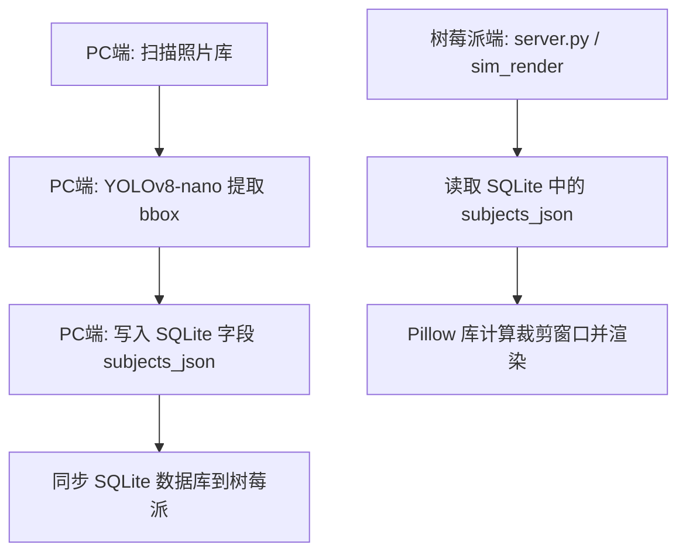

# InkTime 构图感知智能裁切设计方案

> 讨论日期：2026-06-06  
> 状态：设计完成（已验证）  
> 执行环境：PC 端运行 YOLOv8-nano 分析照片并修改数据库，树莓派/PC 端渲染  

---

## 一、方案概览

本项目墨水屏物理尺寸为 $480 \times 800$ 竖屏放置，除底部 120 像素的文本显示区域外，照片显示区域为 $480 \times 680$。传统的**居中裁切**对于非居中构图的照片极易裁切掉重要主体（如偏在画面一侧的人物或宠物）。

本设计方案采用 **YOLOv8-nano + 构图感知黄金分割裁切算法**：
1. **分析阶段（PC端）**：在 PC 端执行 `analyze_photos.py` 时，利用 `ultralytics` 的 YOLOv8-nano 模型检测图像中的核心主体（人、猫、狗），并提取它们的归一化坐标 `[x_center, y_center, width, height]` 以 JSON 格式写入 SQLite 数据库的 `subjects_json` 字段。
2. **渲染阶段（树莓派/PC端）**：渲染程序 `render_daily_photo.py` 读取数据库中已有的主体坐标，基于“构图感知黄金分割映射”算法计算裁切区域左上角，再由 Pillow 进行物理裁切并抖动输出。树莓派端**无需安装**任何深度学习框架或 YOLO 包，仅需执行数学计算与常规 Pillow 裁切，从而完美避开硬件资源瓶颈。

---

## 二、架构与数据流设计



- **PC端依赖**：新增 `ultralytics`，用于执行目标检测。
- **树莓派端依赖**：零新增（无需 PyTorch 或 YOLO 依赖）。

---

## 三、细节设计

### 3.1 数据库结构变更 (DDL)
`photo_scores` 表新增一列 `subjects_json`，用于存储主体列表：
```sql
ALTER TABLE photo_scores ADD COLUMN subjects_json TEXT;
```
如果字段已存在，将通过 `TRY-EXCEPT` 安全忽略。

**`subjects_json` 字段数据结构样例：**
```json
[
  {"label": "person", "bbox": [0.25, 0.45, 0.15, 0.30], "conf": 0.92},
  {"label": "cat",    "bbox": [0.65, 0.72, 0.10, 0.15], "conf": 0.88}
]
```
- `bbox` 格式：`[x_center, y_center, width, height]`（均为 `0.0 ~ 1.0` 相对图像分辨率 of the original image 的浮点数）。
- `label` 限制：只关注 `person` (包含 child 语义)、`cat`、`dog` 等常见家庭相册主体。

### 3.2 智能裁切坐标计算逻辑 (Mathematics & Algorithm)

当我们缩放原图得到大小为 `(draw_w, draw_h)` 的中间图，并需要裁剪出一个 `(img_area_w, img_area_h)` 大小的视口时，需要计算裁剪的左上角起点 `(left, top)`。

1. **主体中心点确定**：
   - 提取所有主体的坐标。若无检测主体，退回居中裁剪：
     $$left\_center = \frac{draw\_w - img\_area\_w}{2}$$
     $$top\_center = \frac{draw\_h - img\_area\_h}{2}$$
   - 若有多个主体，先判断主体间的最大跨度。如果跨度过大（横向或纵向占比超过 80%），则丢弃低优先级或低面积的主体框，仅保留置信度与类别权重乘积最高（`conf * weight`）的单一主体。
   - 合并剩余主体的 bounding box，计算其中心点在缩放后图像中的像素坐标 `(cx, cy)`。

2. **构图感知黄金分割映射**：
   计算主体中心在原图中的相对比例：
   $$r_x = \frac{c_x}{draw\_w}, \quad r_y = \frac{c_y}{draw\_h}$$
   限制该比例在黄金分割阈值区间 `[0.382, 0.618]`：
   $$target\_rel\_x = \text{clamp}(r_x, 0.382, 0.618)$$
   $$target\_rel\_y = \text{clamp}(r_y, 0.382, 0.618)$$
   
   由此得到起点坐标：
   $$left = c_x - target\_rel\_x \times img\_area\_w$$
   $$top = c_y - target\_rel\_y \times img\_area\_h$$

3. **边界安全兜底约束**：
   $$left = \text{clamp}(left, 0, draw\_w - img\_area\_w)$$
   $$top = \text{clamp}(top, 0, draw\_h - img\_area\_h)$$

---

## 四、开发与修改清单

### 4.1 `config.py`
新增配置项：
- `YOLO_CONF_THRESHOLD = 0.3`（置信度阈值）
- `YOLO_CLASSES = ["person", "cat", "dog"]`（检测主体类别）
- `YOLO_CLASS_WEIGHTS = {"person": 5.0, "cat": 4.0, "dog": 4.0}`（优先级权重分配）

### 4.2 `analyze_photos.py`
- 新增 `detect_subjects(image_path)` 函数，在分析每张图片时调用 YOLO 并入库。
- 在 `ensure_table(conn)` 中，增加 `ALTER TABLE photo_scores ADD COLUMN subjects_json TEXT` 的容错执行逻辑。
- 插入/更新数据库时同步写入 `subjects_json` 列。

### 4.3 `render_daily_photo.py`
- 新增 `compute_crop_window(draw_w, draw_h, img_area_w, img_area_h, subjects_json)`。
- 在 `load_sim_rows()` 和相关 SQL 查询中，加入 `subjects_json` 字段读取。
- 重构 `render_image(item)` 函数中的裁剪定位计算，使用 `compute_crop_window` 代替传统的居中逻辑。

### 4.4 `server.py`
- 同样在查询元数据接口 `get_photo_meta_by_path(abs_path)` 中，增加 `subjects_json` 的读取，确保 Web 模拟渲染（`/sim_render`）能同步调用正确的智能裁剪逻辑。

---

## 五、测试与回归建议

1. **增量测试**：选择 10 张包含不同构图（居中、左偏、右偏）的照片，单独调用 `detect_subjects`，输出其 `subjects_json` 并用绘图工具画出 bbox，验证检测精度。
2. **构图对比测试**：对比原居中裁切和黄金分割裁切效果，核对是否成功将非居中人物保留在画面黄金分割线上，无明显切脸。
3. **性能基准测试**：在 PC 端记录 YOLO 推理一张图片的平均时间（预计 GPU 模式下 $< 15$ms，CPU 模式下约 $50 \sim 120$ms）。
