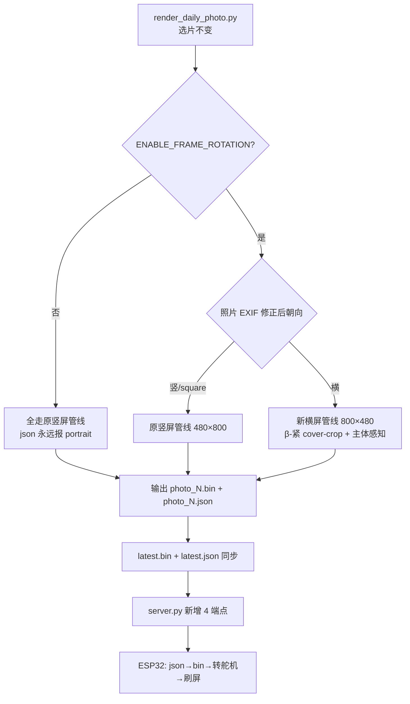

# InkTime 横屏相框自动旋转设计方案

> 讨论日期：2026-07-25
> 状态：设计完成（待实现）
> 适用环境：单 ESP32-L（墨水屏 + 舵机同板）+ 树莓派/PC 渲染服务器

---

## 一、方案概览

InkTime 墨水屏相框当前只支持竖屏显示：无论当日选出的照片是横排还是竖排，渲染器都把它 cover-crop 进 480×800 竖屏画布。**横排照片会被中心裁掉左右大半，主体经常丢失**，体感很差。

本方案新增"相框旋转"能力：当当日正片（`photo_0`）是横排照片时，舵机把整个相框物理转 90°，渲染器也改成横屏 800×480 排版刷屏。竖排照片维持原管线不变。

设计有三个关键约束决定了整体形态：

1. **硬件是单 ESP32-L**：墨水屏驱动和舵机驱动在同一颗芯片上。舵机信号脚必须避开墨水屏 SPI 已占用的 IO（13/12/14/27/18/23）和 strapping pin（0/2/12/15），落在干净的 PWM 脚 25。
2. **舵机转完即撒手**：SG90 转到位后立刻 `detach`，靠相框机械结构（非舵机保持力）维持姿态。这是省电的前提（深睡 ~18.7mA → 5~6 天续航）。代价是机械漂移无软件反馈，本方案以"机械可靠"为假设推进。
3. **功能可选**：新增 `config.py` 开关 `ENABLE_FRAME_ROTATION`，默认关闭。关闭时整条链路对无舵机的老设备零感知。



---

## Problem Statement

作为 InkTime 相框用户，我希望当系统今日选中了一张横排照片（如风景、合影、全景）时，相框能自动横过来显示这张照片的完整内容，而不是把它强行裁成一条竖屏画面、丢失主体。这样横排照片才能以它本来该有的样子被看到。

## Solution

在不动摇选片逻辑的前提下，给"渲染 → 下发 → 显示"这条链路接入朝向感知：

- **服务器**：渲染时按照片实际朝向（EXIF 修正后）路由到竖屏或新横屏管线，每张照片额外输出一个 `.json` sidecar 标注朝向；服务端新增端点下发 sidecar 和两张标定卡。
- **ESP32**：每日流程改为"先下 sidecar 拿朝向 → 下 `.bin` 到 framebuffer → 转舵机 → 刷屏"。失败顺序保证下载失败时不转舵机、保留昨日姿态。
- **标定**：debug 页加一个舵机标定台，跑完整 fetch→转→刷流程，让用户标定竖屏/横屏两个舵机绝对角度、转速、横屏画面方向反转开关。

## User Stories

### 服务器端渲染

1. 作为 InkTime 渲染流程，我希望当 `ENABLE_FRAME_ROTATION=False` 时整个渲染管线行为与今天完全一致，这样无舵机的老设备/服务器升级后零感知。
2. 作为 InkTime 渲染流程，我希望当 `ENABLE_FRAME_ROTATION=True` 且照片 EXIF 修正后为横排时，使用新的 800×480 横屏画布渲染，这样横排照片能完整呈现。
3. 作为 InkTime 渲染流程，我希望竖排和 square 照片永远走原竖屏 480×800 管线（一行不改），这样不会引入竖屏回归。
4. 作为 InkTime 渲染流程，我希望横屏管线采用 cover-crop 填满画布并保留竖屏的"主体感知裁剪"算法（移植到横屏坐标系），这样人脸/宠物不被切掉。
5. 作为 InkTime 渲染流程，我希望横屏文案沿用竖屏的底部半透明叠层风格（高度按横屏画布比例，不照搬绝对像素），这样视觉风格统一。
6. 作为 InkTime 渲染流程，我希望为每张渲染出的 `photo_N.bin` 同步输出 `photo_N.json` 标注朝向和画布尺寸，这样下游（ESP32 / debug）能据此选渲染参数。
7. 作为 InkTime 渲染流程，我希望 `latest.json` 随 `latest.bin` 一起同步，这样用 latest 路径的设备也能拿到朝向。

### 服务器端下发

8. 作为 ESP32 设备，我希望通过 `GET /static/inktime/<key>/photo_<idx>.json` 拿到对应照片的朝向，这样我能决定怎么转舵机和怎么设 Paint 旋转。
9. 作为 ESP32 设备，我希望通过 `GET /static/inktime/<key>/latest.json` 拿到 latest 正片的朝向，与 latest.bin 配套。
10. 作为标定流程，我希望通过 `GET /static/inktime/<key>/calib_p.bin` 和 `calib_l.bin` 拿到朝向无歧义的标定卡（大箭头 + "TOP" + 左右标 + 不对称图案），这样标定时我能一眼判断画面正不正、是不是镜像。
11. 作为服务器，我希望只有 `.bin` 的 fetch 触发 `mark_photo_used`（json/calib 不触发），这样不会因为取朝向而误标已用。

### ESP32 主流程

12. 作为 ESP32 每日流程，我希望按"json → bin(buffer) → 转舵机 → 刷屏"顺序执行，这样下载失败时根本不转舵机，相框保留昨日姿态而非歪着看错位画面。
13. 作为 ESP32 每日流程，我希望当 sidecar json fetch 失败时降级用 NVS 里的 `last_orientation` 仍然尝试下载 bin，这样 sidecar 临时不可用也不至于一张照片都显示不了。
14. 作为 ESP32 每日流程，我希望当 bin fetch 失败时既不转舵机也不刷屏，直接进深睡，这样体感是"今天没更新"而不是"歪着看昨天"。
15. 作为 ESP32 每日流程，我希望舵机未标定（`servo_calibrated=false`）时跳过所有舵机动作但渲染照常进行，这样开箱首次开机或恢复出厂后仍能看到照片。
16. 作为 ESP32 每日流程，我希望首次开机（NVS 无 `last_orientation`）时无条件转到竖屏 home 角度并写入 `last_orientation=portrait`，这样从已知物理姿态起步。
17. 作为 ESP32 每日流程，我希望当日朝向与 NVS `last_orientation` 相同时跳过舵机转动但仍下载刷屏，这样省机械磨损和电。
18. 作为 ESP32 每日流程，我希望舵机转动用阻塞小循环（每 20ms 推进一次），超时 3 秒后强制 detach 并继续渲染，这样舵机异常不会卡死整张照片。
19. 作为 ESP32 每日流程，我希望舵机转动到位或超时后立即 `detach`，靠相框机械结构维持姿态，这样深睡电流能压到 ~18.7mA、维持 5~6 天续航。
20. 作为 ESP32，我希望 Paint 旋转方向由 `rotate180`（竖屏）和 `landscape_invert`（横屏）两个独立标定项决定，这样朝向物理事实交给现场标定而非硬编码。
21. 作为 ESP32，我希望配网/IP 信息页（`showNetworkInfoScreen`）永远按竖屏渲染不受舵机影响，这样配网阶段显示稳定。

### 标定与 debug

22. 作为相框安装者，我希望在 debug 页能填入"竖屏角度 / 横屏角度 / 转动速度 / 横屏画面方向反转"四个标定字段，然后用"测试竖屏""测试横屏"按钮验证，这样我装好相框后能现场标定舵机。
23. 作为相框安装者，我希望"测试"按钮用**表单当前值**（而非已保存值）执行完整 fetch 标定卡 → 转舵机 → 刷屏流程，这样反复迭代标定不用每次先保存。
24. 作为相框安装者，我希望"测试"按钮在网络 fetch 失败时仍然执行舵机转动（不刷屏），这样在服务器还没配好时也能先调机械角度。
25. 作为相框安装者，我希望"保存标定"按钮把四个字段写入 NVS 并置 `servo_calibrated=true`，之后每日流程才启用自动旋转。
26. 作为相框安装者，我希望标定按钮用的代码路径与每日正常运行**完全相同**（同一套 fetch / 转动 / 刷屏），这样每次标定就是一次端到端真测试、不会出现"标定时能转、运行时不转"。
27. 作为相框安装者，我希望标定时能根据相框实际重量调整舵机转速（默认 40°/s 写入 NVS），这样 SG90 带重相框不失步。

### 兼容与降级

28. 作为老设备用户（无舵机、`ENABLE_FRAME_ROTATION=False`），我希望服务器和固件升级后行为完全不变，sidecar json 永远报 portrait，这样我不被强制升级硬件。
29. 作为运维者，我希望知道当机械保持不可靠（相框漂移）时，软件层面无自动纠正能力，需要后期改"舵机保持通电"策略牺牲续航——这是已知风险，本方案不解决。

---

## Implementation Decisions

### 配置开关

- 新增 `config.py` 字段 `ENABLE_FRAME_ROTATION`（布尔，默认 `False`）。
- 新增 `LANDSCAPE_CANVAS_WIDTH = 800`、`LANDSCAPE_CANVAS_HEIGHT = 480`。
- **语义**：开关控制是否启用横屏渲染分支。开关关闭时，横排照片照旧被竖屏管线 cover-crop（与今天完全一致），sidecar json 永远报 `portrait`。开关开启时，横排照片走新横屏管线，竖排/square 走原管线。

### 服务器渲染模块

- **不修改选片逻辑、不修改 EXIF 处理、不修改 dither。** 所有改动集中在 `render_image()`、`image_to_palette_bin()`、`main()`。
- DB 读取层把 `width/height/orientation` 加入 SELECT，但**最终朝向以渲染器内 `ImageOps.exif_transpose` 之后的 `img_w/img_h` 为准**——DB 列是 pre-transpose 填充的，对带 EXIF 旋转标记的照片不可信。
- `render_image()` 在拿到修正后的 `img_w/img_h` 后路由：`use_landscape = ENABLE_FRAME_ROTATION and (img_w > img_h)`；竖屏路径保留全部现有像素布局逻辑。
- 新增 `render_image_landscape(item, img)` 函数：
  - 画布 800×480。
  - cover-crop：`scale = max(800/img_w, 480/img_h)`，超出部分裁掉。
  - 主体感知裁剪：移植现有"构图感知黄金分割"算法到横屏坐标系（宽 > 高，几何参数重算）。
  - **不做 letterbox 回退**（β-紧）：横屏画布矮宽，照片基本填满，回退概率极低；真看到切脸再加。
  - 文案底部半透明叠层：移植现有竖屏叠层风格，高度按横屏画布比例（约 15%），字号与换行逻辑基本不动。
  - 函数签名预留 `text_layout="bottom"` 参数，为未来"侧栏文案"排版留接口、本方案不实现。
- `image_to_palette_bin()` 解锁双尺寸校验：接受 `(480,800)` 或 `(800,480)`，按图像实际宽高迭代（不再硬编码常量）。
- `main()` 渲染循环里，每张照片额外输出 `photo_N.json`：`{"orientation": "portrait"|"landscape", "w": W, "h": H}`，其中 W/H 是该照片实际画布尺寸。
- `latest.*` 同步块额外 `cp photo_0.json → latest.json`。

### 服务器下发模块

- 新增 4 个端点，仿现有 `esp_photo` 模式：
  - `GET /static/inktime/<key>/photo_<int:idx>.json` —— 返回 sidecar，**不调 `mark_photo_used`**。
  - `GET /static/inktime/<key>/latest.json` —— 返回 latest sidecar。
  - `GET /static/inktime/<key>/calib_p.bin` —— 静态竖屏标定卡。
  - `GET /static/inktime/<key>/calib_l.bin` —— 静态横屏标定卡。
- 标定卡是朝向无歧义的图案（大向上箭头 + "TOP" 文字 + 左右标记 + 一个不对称图形），由独立脚本 `render_calib_cards.py` 生成（调 `image_to_palette_bin`），产物 `output/inktime/calib_{p,l}.bin`，**部署一次即可、不随每日 `render_daily_photo.py` 重跑**。

### ESP32 舵机模块（自写，参考 servo_serial_cmd/motion）

- 新增极简舵机驱动（约 50 行），只做"转到绝对角度、转完 detach"，**不搬** `servo_serial_cmd/webui.cpp` 那套通用控制台（velocity/range/往复/串口命令全部不要）。
- 接口形态：
  ```cpp
  void servo_init(int pin);                   // IO25
  bool servo_rotate_to(float target_deg, float speed_deg_s,
                       uint32_t timeout_ms = 3000);
  void servo_detach();
  ```
- 实现要点（吸收 `motion` 踩过的坑）：用 `millis()` 算 dt、20ms 推进；到位或超时立即 `detach()`；`setup()` 早期调 `ESP32PWM::allocateTimer(0)` + `setPeriodHertz(50)` + `attach(25, 500, 2400)`。
- **IO25 选定理由**：避开墨水屏 SPI 占用（13/12/14/27/18/23）+ strapping pin（0/2/12/15）+ LED（2），且是 ESP32Servo 常用的干净 PWM 脚。

### ESP32 配置持久化

- 复用现有 NVS 命名空间 `dashcfg`（不另开），在现有 `Config` 结构上新增字段：
  - `servo_portrait_deg`（float）—— 竖屏目标角度，标定写入。
  - `servo_landscape_deg`（float）—— 横屏目标角度，标定写入。
  - `servo_speed`（float，默认 40）—— 转动速度 °/s。
  - `servo_calibrated`（bool，默认 false）—— 是否已标定，false 时禁用舵机且不挡渲染。
  - `landscape_invert`（bool，默认 false）—— 横屏画面方向反转，现场标定。
  - `last_orientation`（String，默认空）—— 跨深睡存活，空串触发首次开机归位。
- `loadConfig`/`saveConfig` 相应扩展读写。

### ESP32 主流程重构

- 将现有"下载并立即刷屏"的一体函数**拆成两阶段**：
  - 阶段 A：fetch sidecar json + fetch bin 到 framebuffer，**不触碰 EPD**。
  - 阶段 B：根据朝向选 Paint 旋转方向 + 刷屏。
- 下载循环的字节流迭代边界**按 sidecar 朝向动态切换**：portrait → 480×800 行序，landscape → 800×480 行序。字节数都是 384000，缓冲区分配不变。
- Paint 旋转真值表（在阶段 B 内）：
  - 竖屏：`rotate180 ? ROTATE_270 : ROTATE_90`（现状不动）。
  - 横屏：`landscape_invert ? ROTATE_270 : ROTATE_90`（初值，标定验证后可调）。
- `setup()` 主流程顺序改为：
  1. fetch `photo_0.json` → orientation（失败 → 用 NVS `last_orientation` 降级，仍尝试下载）。
  2. fetch `photo_0.bin` → framebuffer（失败 → 不转舵机、不刷屏、保留昨天姿态、进深睡）。
  3. 舵机决策：
     - `!servo_calibrated` → 跳过转动。
     - `last_orientation` 空 → 转 `portrait_deg`，写 `last_orientation=portrait`。
     - 朝向 == `last_orientation` → 跳过转动。
     - 不同 → 转对应角度（阻塞循环，3 秒超时 detach 继续），成功后写 `last_orientation`。
  4. `displayFramebuffer(orientation)`。
  5. （仅手动唤醒）启动 web server + 标定台。
  6. 深睡到下次刷新。
- `showNetworkInfoScreen()` 永远竖屏渲染，不受舵机影响。

### ESP32 标定台（debug 页扩展）

- debug 页新增舵机标定区块，含：竖屏角度 / 横屏角度 / 转动速度 / 横屏方向反转 四个输入字段 + "测试竖屏""测试横屏""保存标定"三个按钮。
- 新增路由：
  - `GET /servo?test=portrait` —— 用**表单当前值**执行完整流程：fetch `calib_p.bin` → framebuffer → 按当前角度/speed/invert 转舵机 → 刷屏。网络 fetch 失败则只转舵机不刷屏。
  - `GET /servo?test=landscape` —— 同上，用 `calib_l.bin` + landscape 角度。
  - `POST /servo_save` —— 把四个字段写入 NVS 并置 `servo_calibrated=true`。
- 测试按钮的代码路径**与每日正常运行完全相同**（同一套 fetch / 般机转动 / 刷屏函数），确保标定 = 端到端真测试。

### EPD 几何事实（影响实现的关键认知）

- 墨水屏硬件原生分辨率 800×480（横屏物理）。当前竖屏 480×800 是靠 Paint 的 `ROTATE_90/270` 把逻辑竖屏 framebuffer 映射上去的。
- 因此**横屏 `.bin` 与竖屏 `.bin` 字节数完全相同**（800×480 == 480×800 == 384000 字节）。固件下载缓冲区、`targetBytes`、字节数校验全部不变，只有"逻辑画布宽高"和 Paint 旋转方向随朝向切换。这是固件层改动比想象小的根本原因。

---

## Testing Decisions

### 测试哲学

只测外部行为，不测实现细节。本项目无 pytest、无 CI，测试惯例是 `scripts/test_*.py` 形态的**可视化 golden test**——渲染已知输入、把产物（PNG/JSON）dump 到 `output/` 供人工肉眼检查。这套风格贴合本项目"渲染质量最终靠人眼看构图"的现实。

### 测试缝（test seams）

**新增一个测试缝**：`scripts/test_landscape_render.py`（可视化 golden test，匹配 `scripts/test_crop_comparison.py` 先例）。覆盖：

- 服务器渲染朝向路由：从真实 DB 取已知横排照片和竖排照片，分别渲染，dump `preview_N.png` + 生成的 `photo_N.json` sidecar 到 `output/`。
- 横屏画布几何：检查 PNG 实际尺寸为 800×480。
- sidecar 内容：检查 json 的 `orientation` / `w` / `h` 与渲染决策一致。
- cover-crop + 主体感知：人工检查横屏 preview 没有切掉主体。
- `ENABLE_FRAME_ROTATION=False` 降级：临时关开关重跑，确认横排照片走竖屏管线、json 报 portrait。
- `latest.json` 同步：确认存在且内容等于 `photo_0.json`。

**扩展一个既有测试缝**：ESP32 侧不引入新自动化测试基础设施（Arduino C++ 无现成单测框架），改为复用本项目已有的 debug 手动验证机制——通过新增的标定台（`/servo?test=portrait|landscape`）在真机上做端到端可视化验证。这不是新测试缝，是给现有 `/debug` `/fetch` 手动测试基础设施加了一个面向舵机的入口。

### 不做的测试

- 不引入 pytest（与项目惯例不符，requirements.txt 无此依赖）。
- 不为 HTTP 端点单独写测试——新端点是薄文件服务，行为等价于已有 `esp_photo`，渲染 golden test 顺带覆盖。
- 不写舵机驱动的单元测试——硬件行为靠真机标定台验证。

---

## Out of Scope

- **不修改选片逻辑**：朝向不影响"哪张照片被选中"，只影响"选中后怎么渲染"。
- **不修改 EXIF 处理、不修改 dither 算法**。
- **不做横屏 letterbox 回退**（β-紧）：横屏画布矮宽，回退概率极低；真看到切脸再加。
- **不做横屏文案侧栏排版**：本轮只做底部叠层（i），侧栏（ii）留函数接口不实现。
- **不做舵机位置反馈 / 机械漂移检测**：以"机械保持可靠"为假设推进。机械漂移是已知风险，后期若发现可改"舵机保持通电"策略（牺牲续航换准确），不在本方案范围。
- **不搬 `servo_serial_cmd/webui.cpp` 通用控制台**：本方案舵机只需"两个绝对角度之间切换 + 转完撒手"，velocity/range/往复/串口命令全套通用控制台是负资产。
- **标定卡不走固件内嵌**：标定卡由服务器生成并下发。代价是标定要求设备已配好 WiFi/服务器（AP 配网阶段无法标定）；好处是标定卡可独立更新、固件不膨胀。未来若想要纯离线标定，内嵌方案随时可补，不破坏当前设计。
- **不改 BLE 推送链路**：本方案只覆盖 WiFi 拉取式投递（`ink-display-wifi-epd`）。
- **不引入 GitHub issues 流程**：仓库 issues 已禁用，spec 发布到 `docs/plans/`（项目惯例）。

---

## Further Notes

### 实现顺序建议（4 个独立可验证 commit）

1. **服务端**：`config.py` 开关 + 横屏渲染字段 + `render_image_landscape()` + `image_to_palette_bin` 解锁 + sidecar json + `latest.json` 同步 + `server.py` 4 端点 + `render_calib_cards.py`。可独立验证：跑 `render_daily_photo.py` + `scripts/test_landscape_render.py`，检查 `output/inktime/photo_0.json` 和横屏 `preview_0.png`。
2. **固件舵机**：`servo_rotate.{h,cpp}` + NVS 扩展 + 主流程重构（json→bin→转→刷）+ Paint 真值表。
3. **固件标定台**：debug 页 UI + `/servo?test=*` + `/servo_save` 路由。
4. **文档**：`esp32/servo_serial_cmd/README.md` 增加"已整合进 ink-display-wifi-epd"章节，标注原 standalone 项目与新整合的关系。

### 风险登记

| 风险 | 影响 | 缓解 |
|---|---|---|
| 机械保持不可靠，相框逐日漂移 | 画面逐渐歪斜，无软件反馈 | 已知风险。后期可改"舵机保持通电"（续航 5~6 天 → ~1.5 天，需有线供电） |
| `landscape_invert` 初值方向猜反 | 横屏画面首次显示是倒的 | 现场标定一次即修正；标定卡设计确保方向无歧义 |
| 舵机扭矩不足带不动相框 | 转不到位或失步 | 标定台开放 `servo_speed` 调整，默认 40°/s 偏慢保扭矩 |
| sidecar json 端点未部署时老固件升级 | 老固件 fetch json 404 | 降级用 NVS `last_orientation`，仍能下 bin 显示 |
| `ENABLE_FRAME_ROTATION` 默认 False 导致用户以为功能没做 | 用户不知道要开开关 | 文档明确说明；sidecar 默认 portrait 保证老设备不受影响 |

### 关联文档

- 设计前置讨论：本文件即 grilling 收口产物。
- 先例（同样风格的 docs/plans 设计 + 实现 配对）：`docs/plans/2026-06-06-smart-crop-design.md` + `2026-06-06-smart-crop-implementation.md`。
- 舵机模块来源与整合指南：`esp32/servo_serial_cmd/CLAUDE.md`（场景 B 最小集成）。

---

## 附录：开机/唤醒舵机策略（2026-08-30 修订，源自设备日志实测）

设备日志（`logs/device/<key>.log`）实证了早期设计的缺陷并驱动了三轮修订：

1. **事故**：`servo_init()` 首帧 `write(0)` + "同朝向跳过" → 每次开机舵机全速甩到
   机械零点后停在原地，而屏幕重画原照片（`SERVO_SKIP ori=… last=…`）——"舵机突然
   归零、显示没变"。
2. **首帧改写上次角度**：断电期间舵机机械保持在原位，`servo_init(bootAngle)`
   首帧驱动到 `last_orientation` 对应角并置 `_angleKnown=true` → 定时唤醒零动作。
   无反馈舵机的物理边界：若断电期间被外力拨动，首帧会全速修正一次（不可平滑，
   因为起点未知）。
3. **手动唤醒 = 机械归零（re-home）**：reset 键视为用户主动纠偏——先平滑压到
   机械 0°（硬限位，唯一绝对参考）停靠片刻，再回到**当前显示照片**对应的角度
   （注意不是新照片的角度：若随后拉取失败，屏上画面与物理朝向仍一致）。
   之后 `applyServoForOrientation` 的跳过条件改为 **角度制**（`servo_at_angle`）：
   朝向相同且已在该角度才跳过，归零后/超时未到位都会自动补转。

功耗/磨损权衡：定时唤醒（每日 1 次）全程零动作；手动唤醒才产生一次归零扫动。
