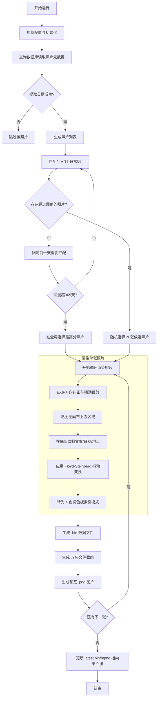

# InkTime 每日照片渲染程序 (`render_daily_photo.py`) 逻辑分析

本文档详细介绍了 `render_daily_photo.py` 的工作流程，该脚本负责从照片数据库中挑选“历史上的今天”照片，并按照墨水屏规格进行转换和渲染。

## 1. 核心流程概览

程序的主要执行逻辑可以分为以下六个阶段：

1.  **初始化**: 读取 `config.py` 配置，设定画布尺寸（480x800）和字体路径。
2.  **数据加载**: 连接 SQLite 数据库 (`photos.db`)，提取包含 EXIF 信息的照片元数据。
3.  **照片选择**: 
    *   匹配当前日期的“月-日”。
    *   筛选回忆度（`memory_score`）高于阈值的照片。
    *   如果在当天找不到，则逐日回溯（最长 365 天）。
    *   如果依然找不到，则在全局中选择得分最高的照片。
4.  **图像渲染**:
    *   对原图进行 EXIF 方向纠正。
    *   按“铺满裁剪”模式缩放并裁剪至 480x700 区域。
    *   在底部 100 像素区域绘制文案（Side Caption）、日期和拍摄地点。
5.  **图像处理 (抖动算法)**:
    *   应用 **Floyd-Steinberg 抖动算法**。
    *   将 RGB 颜色量化为墨水屏支持的四种颜色：**黑、白、红、黄**。
6.  **输出生成**:
    *   生成 `.bin` 文件（1 字节 1 像素，行优先）。
    *   导出 C 语言头文件 (`.h`) 数组供 ESP32 使用。
    *   保存预览图片 (`.png`)。

---

## 2. Mermaid 流程图

---

## 3. 详细函数说明

### 3.1 数据处理
*   `load_sim_rows()`: 核心数据读取函数。它不仅从数据库拉取字段，还调用 `extract_date_from_exif` 来处理那些 EXIF 丢失但文件名包含日期的照片。
*   `extract_date_from_exif(exif_json, filepath)`: 支持从 JSON 或正则表达式（匹配 YYYY-MM-DD, YYYYMMDD, YYYYMM 格式）提取日期。

### 3.2 选片逻辑
*   `choose_photos_for_today(items, today, count)`: 实现了精细的回溯机制。
    *   **优先级1**: 今天的“历史上的今天”，且回忆度 > 阈值。
    *   **优先级2**: 往回倒推最接近的“有高分照片”的日子。
    *   **优先级3**: 全局最高分。

### 3.3 图像处理
*   `render_image(item)`: 使用 Pillow (PIL) 进行绘制。使用 `LANCZOS` 平滑缩放，并从中间裁剪。
*   `apply_four_color_dither(img)`: **这是画画的关键**。纯色量化会导致墨水屏颜色层级感严重丢失，抖动算法能模拟出更多的中间色调，让照片看起来更细腻。
*   `image_to_palette_bin(img)`: 将抖动后的图像压缩为每个像素 1 个字节的数据流。

### 3.4 硬件兼容
*   `write_h_array(bin_path, h_path)`: 将二进制数据直接转义为十六进制数组（如 `0x00, 0x01, ...`），方便 ESP32 固件直接 `#include` 静态编译到程序中。

---

## 4. 结论与优化建议

该脚本已经非常成熟，能够处理缺失 EXIF 的边缘情况，并为四色墨水屏专门优化了抖动算法。

**建议**:
1.  **字体加载**: 脚本中包含针对 Windows 的字体硬编码回退，在 Linux 环境运行需确保 `config.py` 配置了正确的字体路径。
2.  **性能**: 对于大型照片库，`load_sim_rows` 每次运行都重新解析所有 JSON 可能会有延迟。如果照片库极大，可以考虑在数据库中增加一个 `parsed_date` 列。
